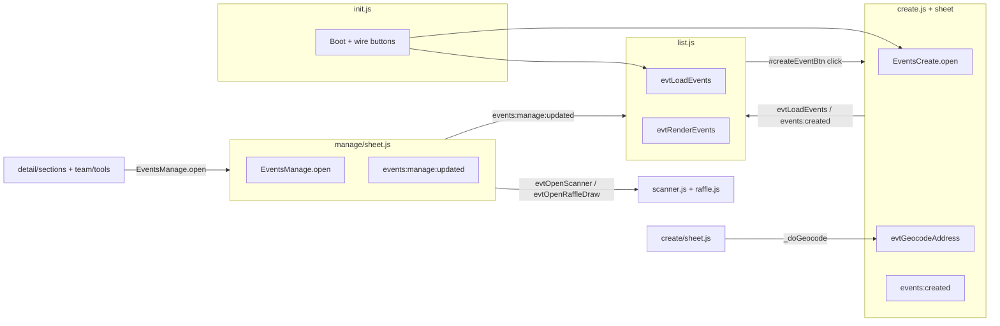

# Events Refactor — List / Manage / Create Risk & Smoke Map

**Document:** `050_list_manage_create_risk_smoke_map.md`  
**Path:** `docs/audit/pages/events/050_list_manage_create_risk_smoke_map.md`  
**Date:** 2026-05-21  
**Status:** **Audit complete (combined map only)** — no implementation  
**Kickoff:** `046_list_manage_create_audit_kickoff.md` (`1ce201c`)  
**Source inventories:** `047` (`59fbe7e`), `048` (`8e6f2c0`), `049` (`5224f0e`)  
**Related:** `025_phase_5_remaining_refactor_completion_roadmap.md`, `045_phase_5l_closeout_and_next_gate.md`

---

## 1. Current Baseline

| Item | State |
| --- | --- |
| **Phase 5L** | **Closed** — production **3-tag** model (`index.js` → `classic-chain-loader.js` → `init.js`); live QA **18/18** (`044`, `d483f6a`) |
| **047 list inventory** | Committed (`59fbe7e`) |
| **048 create inventory** | Committed (`8e6f2c0`) |
| **049 manage inventory** | Committed (`5224f0e`) |
| **This doc** | **Audit-only** — cross-surface risk/smoke synthesis |
| **5M.x implementation** | **Not started**, **not approved** |
| **5L.4 / Option D** | **Not started** |

```text
Audit track: 046 kickoff → 047 list → 048 create → 049 manage → 050 (this map) → 051 review (proposed)
```

---

## 2. Cross-Surface Size Map

| Surface | Path(s) | Lines | Bytes (approx.) | Files |
| --- | --- | ---: | ---: | ---: |
| **List** | `js/portal/events/list.js` | **2,761** | **~148 KB** | 1 monolith (IIFE) |
| **Create** | `js/portal/events/create.js` | **625** | **~39 KB** | 2 files |
| **Create sheet** | `js/portal/events/create/sheet.js` | **1,009** | **~65 KB** | (above) |
| **Create combined** | `create.js` + `create/sheet.js` | **~1,634** | **~104 KB** | — |
| **Manage** | `js/portal/events/manage/sheet.js` | **2,140** | **~149 KB** | 1 monolith (IIFE) |
| **Manage orchestrator** | `js/portal/events/manage.js` | — | — | **Does not exist** |

| Rank by size | Surface | Notes |
| --- | --- | --- |
| 1 | List | Largest single file; central orchestrator |
| 2 | Manage | Single file; destructive tabs |
| 3 | Create (combined) | Smallest total blast radius; dual paths |

**Loader order (middle chain excerpt):**

```text
… → list.js (early) → team/* → detail/* → …
→ create.js → create/sheet.js → … → manage/sheet.js?v=112 (last) → init.js
```

---

## 3. Surface Responsibility Comparison

| Dimension | **List** (`047`) | **Create** (`048`) | **Manage** (`049`) |
| --- | --- | --- | --- |
| **Primary role** | Portal events **home** — load, filter, render all list modes | **New event** flows — default sheet + legacy modal | **Host/admin** event operations — 8-tab sheet |
| **Data load** | `loadEvents` → global caches (`evtAllEvents`, attendee maps, hero inputs) | Sheet `_submit` / legacy `evtHandleCreate` inserts | `_loadEventData` + per-tab lazy loaders |
| **Render orchestration** | `renderEvents` — search / calendar / buckets / hero / rails | Step machine `_render` (4 steps) | `_renderTab` / `_renderTabAsync` (8 tabs) |
| **Filters / UX** | `#evtFilter*`, vlift mobile, search suggest, right rail, mini cal | Basics → When & Where → Pricing → Review | Tab bar; overview ops cards |
| **Hero / buckets / calendar** | Featured hero, lifecycle buckets, month calendar | N/A (post-create navigates to detail) | Overview stats only (read-mostly details card) |
| **Editing** | None (navigation + refresh) | Full create fields (sheet: member; modal: LLC/comp) | Copy (title/description), images, docs, raffle; **not** date/location in-sheet |
| **Storage** | Indirect (displays URLs) | `event-banners`, raffle prize buckets | `event-banners`, `event-documents`, `event-raffle-prizes` |
| **Danger / destructive** | None | N/A at create time | Cancel, complete, delete, participation reset |
| **Custom events** | Listens `events:manage:updated` | Dispatches `events:created` (sheet) | Dispatches `events:manage:updated` / `deleted` |
| **Public API** | `evtLoadEvents`, `evtRenderEvents`, `PortalEvents.list` | `EventsCreate`, `PortalEvents.create`, `evtGeocodeAddress` | `EventsManage`, `PortalEvents.manage`, `_emToggleFeatured` |

---

## 4. Highest-Risk Areas (Cross-Surface, Ranked)

Rough priority for test investment and refactor sequencing. **Rank** = relative blast radius × reversibility × coupling.

| Rank | Area | Surface | Why high |
| ---: | --- | --- | --- |
| **1** | **Danger zone + participation reset** | Manage | Permanent delete; `manage-event-participation` edge wipes RSVPs/raffle/check-ins |
| **2** | **`_submit` / `evtHandleCreate` inserts** | Create | Wrong `status`, slug, storage, raffle JSON, competition phases |
| **3** | **`loadEvents` + global caches** | List | Empty/wrong list; breaks detail routing, hero, attendee display, downstream modules |
| **4** | **`renderEvents` orchestrator** | List | Wrong mode (search/calendar/bucket); duplicated hero/rails |
| **5** | **Raffle tab (manage)** | Manage | ~700+ lines; `EventsRaffleModel`, prize images, draw handoff, winner assignment |
| **6** | **Dual-path create routing** | Create | `EventsCreate.open()` vs `#createModal` / `evtHandleCreate` — dead button or wrong UX |
| **7** | **Inline `onclick` dependencies** | Create + Manage (+ list templates) | LLC cost HTML; `_emToggleFeatured`; scanner handoff; detail/team `EventsManage.open` |
| **8** | **Custom event contracts** | All three | `events:created`, `events:manage:updated`/`deleted` — list/admin refresh coupling |
| **9** | **Loader-order / bridge contracts** | All three | `init.js` boot; `evtGeocodeAddress` (create); `evtOpenScanner` / `evtOpenRaffleDraw` (manage); chain last = manage |
| **10** | **`_wireCardClicks` / list navigation** | List | Wrong event or full reload |
| **11** | **`evtGeocodeAddress` / edge geocode** | Create | Sheet + legacy blocked on bad coordinates |
| **12** | **Featured toggle + hero refresh** | Manage → List | `_emToggleFeatured` + `events:manage:updated` → full `evtLoadEvents` |

### 4.1 High-risk by surface (detail)

| Surface | High-risk (from inventories) |
| --- | --- |
| **List** | `loadEvents`, `renderEvents`, `_wireCardClicks`, `H.groupByBucket`, `init.js` boot order |
| **Create** | `_submit`, `evtHandleCreate`, dual path, geocode, raffle normalization, LLC inline onclick |
| **Manage** | Danger actions, participation edge, raffle saves, `STATE`/`tabData` races, scanner close timing |

---

## 5. Smoke Coverage Matrix

### 5.1 List

| Smoke / test | What it checks | Gaps |
| --- | --- | --- |
| **`test/_smoke-phase3a-list-bridge.js`** | **Primary** — IIFE, `window.evt*`, `PortalEvents.list`, internal fn strings, **direct** `list.js` tag in `events.html` | **3-tag mismatch:** may fail HTML tag assertion (see §6); no `loadEvents` behavior; no `renderEvents` mode branches |
| **`test/_smoke-phase5l-readiness.js`** | 3-tag model, loader chain includes `list.js`, monolith inventory | No behavioral list tests |
| **`test/_smoke-phase1-bridge.js`** | `init.js` → `evtLoadEvents` / filter wiring | Indirect; no filter predicate tests |
| **`test/_smoke-phase3b-detail-bridge.js`** | List bridge regression block | Shallow |
| **`test/_smoke-phase3d-create-bridge.js`** | Create; `#createEventBtn` not deep | — |
| **`test/_smoke-phase3c-manage-bridge.js`** | Manage strings; `events:manage:updated` not exercised | — |
| **`test/_smoke-phase4f-external-globals.js`** | `list.js` in inventory | Static |
| **Feature smokes** (`_smoke-f*`, `e*`, `d*`) | Targeted vlift/filter/calendar features | Selective, not full gate |
| **Production live QA (`044`)** | List shell, hero, buckets, list↔detail — **18/18** | Best **behavioral** list coverage today |

**Recommended before 5M.2:**

- Extend 3A (or new smoke) to use `test/_portal-events-classic-chain.js` `isProductionLoaded()` for `list.js`.
- Fixture/light test for `loadEvents` global shape after mock fetch.
- `events:manage:updated` → `evtLoadEvents` integration assertion.
- Per extracted module smoke after each 5M.2 slice.

---

### 5.2 Create

| Smoke / test | What it checks | Gaps |
| --- | --- | --- |
| **`test/_smoke-phase3d-create-bridge.js`** | **Primary** — sheet IIFE, `EventsCreate`, `PortalEvents.create`, `events:created`, Supabase refs, **direct** `create/sheet.js` in HTML | **3-tag mismatch** on HTML tag; **`create.js` not inventoried** in 5L monolith note |
| **`test/_smoke-phase5l-readiness.js`** | Monolith note for `create/sheet.js` only | Ignores `create.js` orchestrator |
| **`test/_smoke-phase1-bridge.js`** | `init.js` create button / form submit wiring | Indirect |
| **`test/_e2e-phase3d-create-bridge.js`** | E2E patterns (when run) | Not a full publish pipeline gate |
| **Phase 3A/3B/3C embedded regressions** | Namespace still exists | — |
| **Production live QA (`044`)** | List/detail/team | **No** dedicated create publish / LLC modal E2E in 18-point checklist |

**Recommended before 5M.1:**

- Bridge smoke for **`create.js`**: `evtGeocodeAddress`, `evtHandleCreate`, LLC cost onclick symbols.
- Sheet `_validateStep` / `_submit` golden-field tests.
- E2E: draft vs publish; `events:created` → list refresh.
- **LLC/competition legacy modal** — manual or E2E (only path today).
- Raffle builder regression after any split.

---

### 5.3 Manage

| Smoke / test | What it checks | Gaps |
| --- | --- | --- |
| **`test/_smoke-phase3c-manage-bridge.js`** | **Primary** — IIFE, `EventsManage`, `PortalEvents.manage`, `_emToggleFeatured`, `detail.register`, event **string literals** | **3-tag mismatch:** expects `manage/sheet.js` in `events.html`; static only |
| **`test/_smoke-phase5l-readiness.js`** | `manage/sheet.js` in monolith list + loader chain | No tab behavior |
| **`test/_e2e-phase1-bridge.js`** | Host CTA → open manage; `#emSheetRoot` count | Shallow; overview only |
| **`test/_verify-events-live-globals.js`** | Live `EventsManage`, loader `?v=112` | Globals only |
| **`test/_e2e-phase3d-create-bridge.js`** | Manage namespace regression | Touch only |
| **`test/_qa-portal-parity-signed-in.js`** | Manage button visible for host | No sheet interaction |
| **`test/_smoke-events-010-manage-command-tabs.js`** | Command-center copy/markers, guest RSVP, comp guard strings in source | Static strings; not tab CRUD |
| **`test/_smoke-event-coordinator-events-ui.js`** | References manage path | Coordinator static |

**Recommended before 5M.3:**

- **Smoke-only fix:** update 3C to `isProductionLoaded(html, chain, '../js/portal/events/manage/sheet.js?v=112')` (and orphan-file check via chain) — **before** manage refactor PRs.
- Tab harness: open + switch all 8 tabs without throw.
- Copy save + single `events:manage:updated` dispatch.
- Danger actions: staging-only or mocked; never auto-delete on prod.
- Participation edge contract test for `manage-event-participation`.
- Raffle config round-trip with `EventsRaffleModel` fixture.

---

### 5.4 Cross-cutting smokes (all surfaces)

| Smoke / test | Relevance |
| --- | --- |
| **`test/_smoke-phase1-bridge.js`** | Boot order; list/create/manage globals must exist after chain |
| **`test/_smoke-phase5l-readiness.js`** | **Authoritative** for 3-tag + 27-script chain; all three monoliths listed |
| **`test/_smoke-phase5l3-rehearsal.js`** | Rehearsal loader parity |
| **`test/_portal-events-classic-chain.js`** | Helper: `parseClassicChain`, `isProductionLoaded`, `chainOrderOk` — **use for 3A/3C/3D updates** |
| **Production live QA (`044`)** | Strongest **list** behavioral gate; weak on create publish + manage tabs |

---

## 6. Known Smoke / Test Issues

### 6.1 Phase 3A / 3C / 3D vs 3-tag production HTML

After Phase **5L.3 Option C**, `portal/events.html` loads middle scripts via **`classic-chain-loader.js`**, not per-file `<script src="…/list.js">` tags.

| Smoke | Current check | Likely result on 3-tag HTML |
| --- | --- | --- |
| **`_smoke-phase3a-list-bridge.js`** | `html.includes('src="../js/portal/events/list.js"')` | **Fail** unless tag restored |
| **`_smoke-phase3c-manage-bridge.js`** | `html.includes('src="../js/portal/events/manage/sheet.js"')` | **Fail** |
| **`_smoke-phase3d-create-bridge.js`** | `html.includes('…/create/sheet.js"')` | **Fail** |

**Already aligned:** `test/_smoke-phase5l-readiness.js`, `test/_smoke-phase3b-detail-bridge.js` (uses `_portal-events-classic-chain.js`), and several Phase 5H/5I smokes.

**This commit does not modify tests.** Recommendation:

1. **Before first 5M.x code PR** (or as **5M.0 smoke-only** slice): patch 3A/3C/3D to use `isProductionLoaded()` + chain order assertions from `test/_portal-events-classic-chain.js`.
2. Re-run full Phase 5 gate after patch to confirm green baseline under 3-tag HTML.
3. **Before manage refactor (`5M.3`)**: prioritize **3C** fix — manage smoke also asserts orphan `manage/*.js` must appear in HTML (same issue).

### 6.2 Other gaps

| Issue | Impact |
| --- | --- |
| **5L readiness monolith list omits `create.js`** | Under-reports create surface size |
| **No unified “list/manage/create” behavioral E2E** | Refactor regressions caught late |
| **`events:manage:updated` reload** | Asserted in source only, not runtime listener |
| **LLC create** | Only legacy modal — no automated gate |

---

## 7. Cross-Surface Dependency Map



### 7.1 Directed dependencies (summary table)

| From | To | Mechanism |
| --- | --- | --- |
| **init.js** | List | Calls `evtLoadEvents`, filter listeners, `_onReady` |
| **init.js** | Create | `#createEventBtn` → `EventsCreate.open()`; `#createEventForm` → `evtHandleCreate` |
| **List** | Create | Create tile / buttons delegate to `#createEventBtn` |
| **Create sheet** | **create.js** | `window.evtGeocodeAddress` for When & Where step |
| **Create** | List | `events:created` → `init.js` listener → `evtLoadEvents()`; legacy path calls `evtLoadEvents` directly |
| **Manage** | List | `events:manage:updated` / `_notifyParent('updated')` → `list.js` listener → `evtLoadEvents()` |
| **Manage** | Admin dashboard | `events:manage:deleted` / `updated` → `loadEventsDashboard()` |
| **Detail / team** | Manage | `onclick` → `EventsManage.open(id, { source: 'portal' })` |
| **Manage** | Scanner / raffle | `evtOpenScanner`, `evtOpenRaffleDraw` after close or in-tab |
| **Manage** | Raffle model | `window.EventsRaffleModel` for config/draw queue |
| **List** | Detail | Card navigation, `evtOpenDetail`, URL `?event=` |
| **All** | Shared globals | `supabaseClient`, `evtCurrentUser`, `formatCurrency`, `callEdgeFunction`, `canManageEventBanners`, `PortalEvents.*` |

### 7.2 Shared globals (contract freeze)

| Global / namespace | List | Create | Manage |
| --- | :---: | :---: | :---: |
| `supabaseClient` | read | read/write | read/write/delete |
| `evtCurrentUser` / session | read | read | implicit |
| `PortalEvents.list` | write | — | — |
| `PortalEvents.create` | — | write | — |
| `PortalEvents.manage` | — | — | write |
| `PortalEvents.detail.register` | — | — | write (`manage`) |
| `evtLoadEvents` / `evtRenderEvents` | write | consume | consume (via events) |
| `EventsCreate` / `EventsManage` | — | write | write |
| `EventsRaffleModel` | — | create builder | manage raffle tab |
| `evtGeocodeAddress` | — | write (create.js) | — |
| `_emToggleFeatured` | — | — | write (inline onclick) |

---

## 8. Recommended Implementation Order

**Audit recommendation (not approved):**

| Order | Track | Proposed phases | Rationale |
| ---: | --- | --- | --- |
| **1** | **Create** | **5M.1.x** | **~1,634 lines** total — smallest combined surface; default **sheet** path is more self-contained than list orchestrator; fewer destructive ops than manage |
| **2** | **List** | **5M.2.x** | **2,761 lines** — central UX; many modes (search/calendar/buckets/hero); strong **live QA** today but split needs gradual orchestrator thinning **after** create patterns proven |
| **3** | **Manage** | **5M.3.x** | **2,140 lines** — destructive danger zone + participation edge + largest in-tab raffle block; should follow **stronger** tab/edge smokes (and **3C loader fix**) |

### Why create first

- Smaller than list or manage alone; dual path is complex but **bounded** entry points (`init.js` + two roots).
- Sheet is **IIFE-isolated** (`#ecSheetRoot`); legacy modal is HTML-tied but separable in later 5M.1.5.
- Successful create split establishes patterns (storage helpers, `events:created` contract tests) reused by list refresh tests.

### Why list second

- **Highest line count** and **most coupling** to detail, hero, filters, and global caches.
- Production **18/18** live QA de-risks list **behavior** but not **split** safety — incremental 5M.2 slices required.
- List reload is the **sink** for create and manage events — stabilize create first, then harden list listener tests before large list extractions.

### Why manage third

- **Irreversible** actions (delete, participation reset).
- Raffle tab + inline onclick + scanner handoff = high regression surface.
- Read-only money/comp tabs lower priority but still share `STATE` monolith.

```text
Suggested gate sequence:
  051 audit review → 5M.1.0 approval → create slices …
  → 5M.2.0 approval → list slices …
  → 5M.3.0 approval (+ 3C smoke fix) → manage slices …
```

---

## 9. Pre-Implementation Gates

Before **any** `5M.x` implementation PR:

| Gate | Requirement |
| --- | --- |
| **G1 — Audit review** | `051_list_manage_create_audit_review.md` sign-off (this map + 047–049 reviewed) |
| **G2 — Smoke gaps** | Selected items from §5–§6 implemented (minimum: **3A/3C/3D loader-aware** baseline) |
| **G3 — Per-slice approval** | Written approval doc per `5M.1.n` / `5M.2.n` / `5M.3.n` slice |
| **G4 — PR discipline** | **One focused PR per slice**; no list+create+manage combo |
| **G5 — No parallel tracks** | No **5L.4**, no **CSS cleanup**, no **production HTML** changes in same PR |
| **G6 — QA** | Phase 5 gate + relevant live QA subset after each slice |
| **G7 — Product** | LLC/competition create path decision before shrinking legacy modal (5M.1.6) |

**Explicit no-go (all 5M work):**

- Do not treat 047–050 as implementation approval.
- Do not combine surfaces or compat bootstrap in one PR.
- Do not remove `#createModal` or `#emSheetRoot` injection contracts without compat plan.

---

## 10. Proposed Next Doc

| Doc | Purpose |
| --- | --- |
| **`051_list_manage_create_audit_review.md`** | Final review / sign-off before approving **first** implementation slice (**5M.1.0** create) |

**051 should capture:**

- Acknowledgment of 047–050 complete.
- Selected smoke fixes from §6 (especially 3A/3C/3D).
- Approved first slice scope (recommended: **5M.1.1 geocode extract** or **5M.1.0** sign-off only).
- Explicit deferral of list/manage until create gate passes.

---

## 11. Doc-Only Commit Workflow (this file)

```bash
git status --short
git diff -- docs/audit/pages/events/050_list_manage_create_risk_smoke_map.md
git add docs/audit/pages/events/050_list_manage_create_risk_smoke_map.md
git diff --staged --name-only
git commit -m "Add Events list manage create risk smoke map"
git push
```

---

## Appendix — Quick reference: proposed 5M tracks

| Track | File(s) | Proposed phases (not approved) |
| --- | --- | --- |
| **5M.1 Create** | `create.js`, `create/sheet.js` | 1.0 sign-off → 1.1 geocode → 1.2 steps → 1.3 raffle builder → 1.4 submit → 1.5 legacy → 1.6 unify (product) |
| **5M.2 List** | `list.js` | 2.0 sign-off → 2.1 search → 2.2 right rail → 2.3 filters → 2.4 calendar → 2.5 hero/rails → 2.6 orchestrator |
| **5M.3 Manage** | `manage/sheet.js` | 3.0 sign-off + 3C smoke → 3.1 shell → 3.2 overview → 3.3 images/docs → 3.4 danger → 3.5 raffle → 3.6 RSVPs/money → 3.7 comp → 3.8 onclick cleanup |
