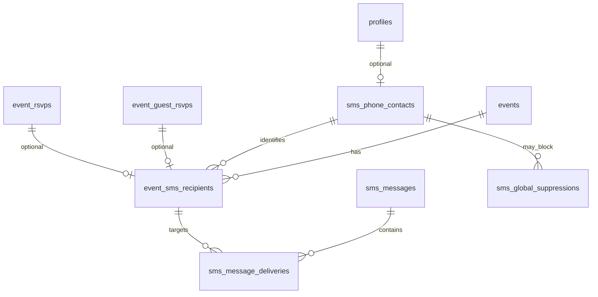

# Event SMS Support — Audit & Plan

Date: 2026-06-02

**Status:** Planning / audit only. No runtime code, migrations, Edge Functions, Twilio wiring, or `portal/events.html` edits in this document.

## Related docs

| Doc | Purpose |
| --- | --- |
| `roadmap.md` | Phased rollout (Phase 0–7) |
| `docs/improvements/pages/events/moderation/000_event_coordinator_role_audit.md` | Coordinator RBAC |
| `docs/todo.md` | SMS vs push product intent |
| `docs/ROADMAP.md` | Phase 4D notifications backlog |

---

## 1. Goal

Plan **SMS event updates** for portal/public Events:

- **Guest RSVP:** keep name + email; add optional phone + explicit SMS consent.
- **Member RSVP:** use `profiles.phone` when present; event-level opt-in path; never block RSVP without phone.
- **Automated SMS v1:** RSVP thank-you/confirmation; 24h reminder (opted-in only).
- **Manual SMS v1:** coordinators/admins send from Manage Event **Notifications** tab; cancellation SMS only after **confirmed** modal (no blind auto-send on cancel/delete).
- **Foundation:** shared SMS tables/functions; Events-specific recipient resolution and UI.

---

## 2. Current-state investigation checklist

Use this checklist before the first migration PR. Items marked **(verified)** were inspected for this doc.

### 2.1 Guest RSVP flow **(verified)**

| Step | Location | Notes |
| --- | --- | --- |
| Public form UI | `js/events/index.js` (injected `guestRsvpSection`), `js/events/body.js` (`pubOpenCtaPanel`) | Fields: `guestNameInput`, `guestEmailInput`, optional `guestNoRefundCheck` (paid) |
| Handler | `js/events/rsvp.js` → `pubHandleGuestRsvp()` | Validates name + email; free → `callEdgeFunctionPublic('rsvp-guest-free', …)` |
| Paid guest | `create-event-checkout` + `stripe-webhook` | Metadata: `guest_name`, `guest_email`; upsert `event_guest_rsvps` |
| Storage | `event_guest_rsvps` (migration `065`) | **No phone columns** today |

**Gap:** Phone/consent must be captured in UI and persisted via Edge Functions (not direct anon insert to SMS tables).

### 2.2 Member RSVP flow **(verified)**

| Step | Location | Notes |
| --- | --- | --- |
| Portal handler | `js/portal/events/engagement/rsvp.js` → `evtHandleRsvp()` | Free: direct `event_rsvps` upsert; Paid: `create-event-checkout` |
| Detail UI | `js/portal/events/detail/sections.js` | RSVP / Interested / paid CTAs — **no SMS UI** |
| Storage | `event_rsvps` (`063`) | `user_id`, `status`, `paid`, `qr_token` — **no SMS flags** |

**Gap:** Member event SMS opt-in needs UI + write path (portal detail or post-RSVP prompt) and link to `profiles.phone`.

### 2.3 Member profile phone **(verified)**

| Item | Location | Notes |
| --- | --- | --- |
| Column | `supabase/migrations/083_member_username_phone.sql` | `profiles.phone` TEXT, E.164 recommended |
| Admin edit | `js/admin/members/members-modal.js` | Admins can set phone |
| Portal profile | `portal/profile.html` / `js/portal/**` | **No phone field** in portal profile UI (grep: no matches) |

**Implication:** Most members will only get SMS via guest-style capture until portal profile phone is added (Phase 7 / separate task).

### 2.4 Permissions system **(verified)**

| Permission | Exists | Used for |
| --- | --- | --- |
| `events.create` | Yes (`078`) | Create events |
| `events.manage_all` | Yes (`078`, `091`) | Global event management, RLS, Edge Functions |
| `events.banners` | Yes | Admin banners |
| `events.manage_notifications` | **No** | **Proposed** (see §5) |
| `events.send_sms` | **No** | Rejected as too narrow for Notifications tab |

**Host model:** Creator, `event_hosts`, or `events.manage_all` (`detail.js` `isHost`, Edge Functions `process-event-cancellation`, `manage-event-participation`).

**Client helpers:** `js/auth/shared.js` — `canCreateEvents()`, `canManageEvents()`, etc. — **no SMS helper yet**.

### 2.5 Notifications / PWA / service worker **(verified)**

| Layer | Location | Purpose |
| --- | --- | --- |
| In-app feed | `notifications` table (`023`, triggers in `069`) | Social, event creator RSVP alerts, competition updates |
| Preferences | `notification_preferences` (`065`) | `event_reminders`, `event_rsvp_updates`, `push_enabled`, etc. — **push categories only, no SMS** |
| Web Push client | `js/push.js`, `js/sw-register.js`, `sw.js` | VAPID subscribe → `push_subscriptions` |
| Push sender | `supabase/functions/send-push-notification` | Triggered on notification insert |
| Event reminders (push) | `supabase/functions/send-event-reminders` | Cron windows: **7d, 72h, day-of** (12h) — **not 24h SMS** |

**Recommendation:** Keep SMS **separate** from PWA push (see §12). Optionally add `notification_preferences.event_sms_reminders` later for members — do not conflate with Twilio guest consent.

### 2.6 Supabase Edge Function patterns **(verified)**

- Deno `serve`, `createClient` with `SUPABASE_SERVICE_ROLE_KEY` for privileged writes.
- Authenticated functions: JWT from `Authorization` + `user_has_permission` RPC (`invite-user`, `process-event-cancellation`).
- Public guest functions: `rsvp-guest-free`, `raffle-guest-free` — no auth; validate input server-side.
- Cron: `pg_cron` + `pg_net` (`027`, `018`); `send-event-reminders` in `config.toml`.
- **No Twilio** functions in `supabase/functions/` today.

### 2.7 Manage Event module **(verified)**

| Item | Location |
| --- | --- |
| Entry | `window.EventsManage.open(eventId)` — `js/portal/events/manage/sheet.js` |
| Tabs | `shell.js` `M3A_TABS`: Overview, Images, RSVPs, Money, Docs, Raffle, Comp, Danger Zone |
| Cancel flow | `manage/danger.js` — `confirm()` then `events.status = 'cancelled'` — **no SMS prompt** |
| RSVP admin | `manage/rsvps.js` — lists members + guests (email, no phone) |

### 2.8 Twilio / SMS prior art **(verified)**

- `docs/todo.md` — explicit SMS vs push separation for events.
- `docs/ROADMAP.md` — Phase 4D Twilio backlog.
- `js/portal/finances.js` — expense categorization regex mentions Twilio (unrelated).
- **No** `TWILIO_*` env usage in codebase.

### 2.9 Pre-implementation verification (remaining)

- [ ] Confirm Twilio account: single existing number vs Messaging Service SID.
- [ ] Confirm TCPA/consent copy with stakeholder (use suggested copy below).
- [ ] `pg_policies` live audit for `event_guest_rsvps` anon read (email lookup) — ensure SMS data not exposed to anon.
- [ ] Stripe guest checkout: pass `guest_phone`, `sms_consent` in metadata through webhook.
- [ ] Staging cron slot for 24h SMS (avoid collision with `send-event-reminders`).

---

## 3. Proposed data model

**Principle:** Shared SMS infrastructure; Events owns **recipient resolution** and UI.

### 3.1 `sms_phone_contacts` (shared)

Normalized phone identity (one row per E.164).

| Column | Type | Notes |
| --- | --- | --- |
| `id` | uuid PK | |
| `phone_e164` | text UNIQUE NOT NULL | Normalized via libphonenumber-style helper in Edge |
| `user_id` | uuid FK → `profiles` nullable | Set when member |
| `created_at` | timestamptz | |
| `updated_at` | timestamptz | |

### 3.2 `sms_global_suppressions` (shared)

Twilio STOP and admin/global blocks — **sender-scoped** where Twilio requires.

| Column | Type | Notes |
| --- | --- | --- |
| `id` | uuid PK | |
| `phone_e164` | text NOT NULL | |
| `reason` | text | `twilio_stop`, `twilio_start_revoked`, `admin`, `invalid_phone` |
| `source` | text | `inbound_webhook`, `admin_ui`, `delivery_callback` |
| `twilio_from` | text nullable | If STOP is per sender number |
| `suppressed_at` | timestamptz | |
| `released_at` | timestamptz nullable | START/UNSTOP |

**Unique:** `(phone_e164, twilio_from)` or global phone-only if single JMLLC sender forever.

### 3.3 `event_sms_recipients` (Events-specific)

Canonical **per-event** SMS audience + consent.

| Column | Type | Notes |
| --- | --- | --- |
| `id` | uuid PK | |
| `event_id` | uuid FK → `events` ON DELETE CASCADE | |
| `contact_id` | uuid FK → `sms_phone_contacts` | |
| `display_name` | text | Guest name or member name |
| `email` | text nullable | Copy for admin UI; guest email |
| `user_id` | uuid nullable | Member link |
| `guest_rsvp_id` | uuid nullable FK → `event_guest_rsvps` | |
| `event_rsvp_id` | uuid nullable FK → `event_rsvps` | |
| `opted_in` | boolean NOT NULL | |
| `opted_in_at` | timestamptz nullable | |
| `opted_out_at` | timestamptz nullable | Event-level opt-out (distinct from global STOP) |
| `consent_source` | text | `guest_rsvp`, `member_rsvp`, `member_profile`, `admin_manual` |
| `consent_text_version` | text nullable | e.g. `event_sms_v1` |
| `created_at` / `updated_at` | timestamptz | |

**Unique:** `(event_id, contact_id)` — one row per phone per event.

**Optional mirror columns** (defer unless needed for reporting):

- `event_guest_rsvps.guest_phone` — nullable; can reduce joins for guest ticket page later.

### 3.4 `sms_messages` (shared)

Outbound batch record (manual or automated).

| Column | Type | Notes |
| --- | --- | --- |
| `id` | uuid PK | |
| `event_id` | uuid nullable FK | Null for future non-event SMS |
| `channel` | text DEFAULT `'sms'` | Extensibility |
| `body` | text NOT NULL | |
| `message_type` | text | `rsvp_confirmation`, `reminder_24h`, `manual`, `cancellation`, `update` |
| `sender_user_id` | uuid nullable | Manual sends |
| `recipient_count` | int | Snapshot at send time |
| `created_at` | timestamptz | |

### 3.5 `sms_message_deliveries` (shared)

Per-recipient Twilio lifecycle.

| Column | Type | Notes |
| --- | --- | --- |
| `id` | uuid PK | |
| `message_id` | uuid FK → `sms_messages` | |
| `event_sms_recipient_id` | uuid nullable FK | |
| `phone_e164` | text | Denormalized |
| `twilio_message_sid` | text nullable | |
| `status` | text | `queued`, `sent`, `delivered`, `failed`, `undelivered`, `opted_out`, `skipped`, `invalid_phone` |
| `error_code` / `error_message` | text nullable | |
| `status_updated_at` | timestamptz | |

### 3.6 `sms_inbound_messages` (shared)

Audit log for STOP/START/HELP and future two-way.

| Column | Type | Notes |
| --- | --- | --- |
| `id` | uuid PK | |
| `phone_e164` | text | |
| `body` | text | |
| `twilio_message_sid` | text | |
| `parsed_command` | text nullable | `STOP`, `START`, `HELP`, etc. |
| `received_at` | timestamptz | |
| `raw_payload` | jsonb | Webhook body |

### 3.7 ERD (conceptual)



---

## 4. Consent / compliance model

### 4.1 Guest RSVP rules

| Rule | Behavior |
| --- | --- |
| Phone optional | RSVP succeeds with name + email only |
| Phone entered | Auto-check SMS consent checkbox (UX); user may uncheck |
| Phone + send SMS | **Requires** `opted_in === true` at save |
| No phone | Consent checkbox ignored / hidden |
| Email | Always collected; remains unused for SMS v1 but retained |

**Suggested consent copy (checkbox label):**

```txt
Text me event updates at this number. Message/data rates may apply. Reply STOP to opt out.
```

Store `consent_text_version = 'event_sms_v1'` on `event_sms_recipients` when opted in.

### 4.2 Member RSVP rules

| Rule | Behavior |
| --- | --- |
| Phone source | `profiles.phone` if non-empty |
| No phone | Do not block RSVP |
| Opt-in | Separate explicit control (toggle/checkbox) for **this event** |
| Profile update | Out of scope v1 — admin can set phone; portal edit later |

### 4.3 Manual admin adds

- Coordinators may add phone + opt-in from Notifications tab (`consent_source = admin_manual`).
- Require same consent copy acknowledgment in send modal for new numbers (product/legal review).

### 4.4 What we do not do in v1

- Auto-opt-in members because profile phone exists.
- Send SMS without checking `event_sms_recipients.opted_in` AND global suppression.
- Auto-send cancellation SMS on `danger.js` cancel without confirmation modal.

---

## 5. Opt-out model

Two layers — **both** must be checked before send:

### 5.1 Global (Twilio STOP)

- Inbound webhook sets `sms_global_suppressions` for `phone_e164` (+ sender if needed).
- Twilio typically blocks at **sender** level — plan sender-scoped rows.
- Handle **START** / **UNSTOP** if forwarded — clear or set `released_at`.
- **HELP** — log inbound; optional auto-reply later.

### 5.2 Event-level

- `event_sms_recipients.opted_out_at` / `opted_in = false` — person declines **this event** but may still receive other events if not globally suppressed.
- Manage Event UI: show status; allow coordinator to mark opt-out (audit).

### 5.3 Send-time skips

Record delivery row as `skipped` or `opted_out` when:

- Global suppression active
- Event recipient not opted in
- Invalid / empty phone after normalization

---

## 6. Permissions model

### 6.1 Recommended permission key

**`events.manage_notifications`**

| Criterion | Why this name |
| --- | --- |
| Tab label | **Notifications** (future email/push in same tab) |
| Scope | View recipients, history, manual send — not only SMS transport |
| vs `events.send_sms` | Too narrow once email exists |

### 6.2 Who can send / view (v1)

| Actor | Access |
| --- | --- |
| Event creator | Yes (per-event host) |
| `event_hosts` | Yes (per-event host) |
| `events.manage_all` (Event Coordinator) | Yes |
| Owner / `admin.dashboard` | Yes (via Owner permissions or manage_all) |
| `events.manage_notifications` only | Yes — allows delegating SMS without full `manage_all` (future) |
| Member attendee | Own opt-in row only (if exposed in settings later) |

### 6.3 Enforcement layers

1. **Edge Function** — `send-event-sms`: JWT + (`user_has_permission('events.manage_notifications')` OR host OR `events.manage_all`).
2. **RLS** — SELECT on `event_sms_recipients`, `sms_messages` for event_id user can manage.
3. **UI** — Hide Notifications tab without permission (defense in depth).

### 6.4 Seed plan

- Add permission to Owner role (`000…001`).
- Add to Event Coordinator role (`000…003`) alongside existing events perms.
- Document in admin Roles UI permission dictionary.

---

## 7. Twilio integration plan

### 7.1 Environment variables

| Variable | Required | Notes |
| --- | --- | --- |
| `TWILIO_ACCOUNT_SID` | Yes | |
| `TWILIO_AUTH_TOKEN` | Yes | Edge secrets only |
| `TWILIO_FROM_PHONE` | One of | E.164 sending number (existing JMLLC number) |
| `TWILIO_MESSAGING_SERVICE_SID` | One of | Alternative to FROM for pools |

Use **existing** number for v1; document migration path to dedicated JMLLC account (Phase 7).

### 7.2 Outbound API

- Prefer Messaging Service if already configured; else `From` + `To`.
- Set `StatusCallback` URL → `twilio-sms-status-callback` per message.
- Segment long bodies; store full body in `sms_messages.body`.

### 7.3 Inbound / compliance

- Configure Twilio phone webhook → `twilio-sms-inbound-webhook`.
- Validate `X-Twilio-Signature` on both inbound and status callbacks.
- Map `MessageStatus` values to internal enum (`delivered`, `undelivered`, `failed`, etc.).

### 7.4 Rate limits / cost

- Manual mass send: cap recipients per request (e.g. 50–100) with batching in Edge Function.
- Log `recipient_count` for billing review.

---

## 8. Edge Functions plan

| Function | Auth | Responsibility |
| --- | --- | --- |
| **`send-sms`** | Service role (internal) | Normalize phone, check suppression, Twilio send, insert deliveries |
| **`send-event-sms`** | User JWT | Permission check, resolve `event_sms_recipients`, create `sms_messages`, invoke `send-sms` |
| **`twilio-sms-status-callback`** | Twilio signature | Update `sms_message_deliveries.status` |
| **`twilio-sms-inbound-webhook`** | Twilio signature | Parse STOP/START/HELP, `sms_inbound_messages`, suppressions |
| **`schedule-event-sms-reminders`** | Cron secret / service | Events starting in ~24h ± window; opted-in recipients only |

**RSVP hooks (invoke async, do not block RSVP response):**

- Extend `rsvp-guest-free` / `stripe-webhook` guest path / member RSVP post-commit to upsert `event_sms_recipients` and optionally enqueue `send-event-sms` with `message_type = rsvp_confirmation`.

**Config:** Register functions in `supabase/config.toml`; add `pg_cron` job for reminders (separate from `send-event-reminders` push cron).

---

## 9. Manage Event UI plan

### 9.1 Tab placement

Add to `M3A_TABS` in `manage/shell.js`:

```javascript
{ key: 'notifications', label: 'Notifications' }
```

Position: after **RSVPs** or before **Danger Zone** (product preference: after RSVPs).

Wire in `manage/sheet.js` `_renderTab` → new module `manage/notifications.js`.

### 9.2 Notifications tab sections

| Section | Features |
| --- | --- |
| **Recipients** | Table: name, phone (masked `***-***-1234`), opt-in, source, last delivery status |
| **Filters** | Opted-in / opt-out / source / search name/email/phone |
| **Actions** | Select rows, “Select all opted-in”, Send SMS |
| **Send modal** | Textarea, character count, recipient count, confirm button |
| **History** | List `sms_messages` for `event_id`; expand deliveries + failures |

### 9.3 Cancellation / delete prompt

When `danger.js` sets status to `cancelled` or delete succeeds:

1. If any `event_sms_recipients.opted_in` for event → show modal: “Send SMS cancellation notice to N recipients?”
2. Pre-fill suggested body (event title, cancelled).
3. Only call `send-event-sms` on confirm — **never** on silent cancel.

Same pattern for major schedule/location edits (manual only in v1).

### 9.4 Permission UX

- Tab visible if `canManageEventNotifications()` (new helper) OR `isHost` with manage_all.
- Send button disabled without `events.manage_notifications` unless `events.manage_all`.

---

## 10. RSVP / member UI plan

### 10.1 Public guest (`js/events/*`)

| File | Change |
| --- | --- |
| `index.js` / guest section HTML | `type="tel"` `guestPhoneInput`, checkbox `guestSmsConsentCheck` |
| `body.js` CTA panel | Mirror fields → sync to main form before `pubHandleGuestRsvp` |
| `rsvp.js` | Validation: if phone → require consent; auto-check on phone `input` event |
| Edge payloads | Add `guest_phone`, `sms_opt_in` to `rsvp-guest-free` + checkout metadata |

**Client UX snippet (behavior):**

```javascript
// On phone input: if non-empty, check consent; if empty, uncheck and disable consent requirement
```

### 10.2 Portal member

| File | Change |
| --- | --- |
| `detail/sections.js` or post-RSVP sheet | After going RSVP: if profile phone, show SMS opt-in toggle |
| `engagement/rsvp.js` | Pass `event_sms_opt_in` to new edge endpoint or second call after upsert |
| `detail/data.js` | Load `event_sms_recipients` for current user + event (for toggle state) |

### 10.3 Paid paths

- Guest paid: collect phone/consent **before** checkout redirect; persist in Stripe metadata; webhook creates recipient + confirmation SMS.
- Member paid: opt-in before or after payment — prefer **before** checkout redirect with metadata flag.

---

## 11. Automated SMS plan

### 11.1 RSVP confirmation

**Trigger:** Successful guest or member RSVP (free or paid).

**Content template (variables):**

- Event `title`
- `start_date` (+ `timezone`) formatted
- `location_text` if not `gate_location` or gate expired
- Raffle: only if `raffle_enabled`
- Docs: only if event has published docs (query `event_documents` count)

**Eligibility:** `opted_in` + valid phone + not globally suppressed.

**Failure:** Log delivery `failed`; do not fail RSVP transaction.

### 11.2 24-hour reminder

**Trigger:** Cron ~24h before `events.start_date` (narrow window, e.g. 23–25h, mirroring push cron style in `send-event-reminders`).

**Audience:** `event_sms_recipients` where `opted_in` and event `status` in `open`, `confirmed`, `active`.

**Not in v1:** 7d / 3d / day-of SMS (push already covers different windows in `send-event-reminders`).

### 11.3 Cancellation / updates

| Type | Delivery |
| --- | --- |
| Cancellation | Manual confirm modal only |
| Location / schedule change | Manual from Notifications tab |
| Custom coordinator message | Manual |

---

## 12. Message history / delivery plan

- **History list:** `sms_messages` filtered by `event_id`, ordered `created_at DESC`.
- **Drill-down:** `sms_message_deliveries` joined to recipients; highlight `failed` / `undelivered`.
- **Realtime:** Optional later via Supabase Realtime on deliveries — not required v1.
- **Admin audit:** `sms_inbound_messages` searchable by phone + date.

**Status mapping (Twilio → internal):**

| Twilio | Internal |
| --- | --- |
| queued, accepted | `queued` |
| sent, sending | `sent` |
| delivered | `delivered` |
| failed | `failed` |
| undelivered | `undelivered` |
| (pre-send skip) | `skipped`, `opted_out`, `invalid_phone` |

---

## 13. Shared notification architecture recommendation

### 13.1 Recommendation: **Hybrid**

| Layer | Shared | Events-specific |
| --- | --- | --- |
| Phone identity + global STOP | `sms_phone_contacts`, `sms_global_suppressions`, `sms_inbound_messages` | — |
| Transport + deliveries | `send-sms`, `sms_messages`, `sms_message_deliveries` | — |
| Audience + consent | — | `event_sms_recipients` |
| UI + cron | — | Notifications tab, `schedule-event-sms-reminders`, RSVP hooks |
| In-app + push | Existing `notifications` + `send-push-notification` | Unchanged |

### 13.2 Do not merge with PWA stack (v1)

| System | Channel | Keep separate because |
| --- | --- | --- |
| `notifications` + `send-push-notification` | Web Push | Browser permission, VAPID, no phone |
| `notification_preferences` | Push categories | No TCPA; different defaults |
| Event SMS | Twilio | Consent, STOP, per-event opt-in, E.164 |

**Future (Phase 7):** Settings page section “Event updates” with **Push** and **SMS** toggles reading different tables — unified UX, separate backends.

### 13.3 Contrast with existing event push reminders

`send-event-reminders` uses `notification_preferences.event_reminders` for **members with push subscriptions** at 7d/72h/day-of.

Event SMS reminders:

- Use `event_sms_recipients` + global suppression
- **24h only** in v1
- Include **guests** with phone consent

Do **not** extend `send-event-reminders` with Twilio in v1 — avoid mixed concerns; add dedicated cron.

---

## 14. Risks / open questions

| # | Risk / question | Mitigation / decision needed |
| --- | --- | --- |
| 1 | **TCPA / consent** | Legal review of checkbox copy; log `consent_text_version` + timestamp |
| 2 | **Twilio STOP scope** | Confirm single sender vs Messaging Service; model `sms_global_suppressions` accordingly |
| 3 | **Guest anon RLS** on `event_guest_rsvps` | Do not expose phone via anon SELECT; SMS tables authenticated/service only |
| 4 | **PII in logs** | Redact phone in Edge console logs; mask in UI |
| 5 | **Paid RSVP race** | Webhook must create `event_sms_recipients` before confirmation SMS |
| 6 | **Duplicate phones** | One `sms_phone_contact` per E.164; multiple events via separate recipient rows |
| 7 | **Member phone missing** | SMS opt-in UI hidden or “add phone in profile” stub until portal profile ships |
| 8 | **Host cancel without SMS permission** | Cancel still works; SMS modal only if permission + opted-in count > 0 |
| 9 | **Message cost** | Batch size limits; coordinator training |
| 10 | **24h vs push 7d/3d** | Intentional product split; document in member comms |
| 11 | **International numbers** | v1 US-only? Normalize and reject non-US? |
| 12 | **Gated location** | Confirmation SMS should respect `gate_location` / `gate_time` flags |

**Open product decisions:**

- Default member event SMS opt-in: off vs on when phone exists?
- Show Notifications tab to `event_hosts` with only `events.manage_notifications` (no `manage_all`)?
- Store `guest_phone` on `event_guest_rsvps` for support lookup?

---

## 15. Recommended first implementation phase

**After approval of this audit:**

1. Migration **`094_event_sms_notifications.sql`** (Phase 1 tables + RLS + seed `events.manage_notifications`).
2. Edge **`send-sms`** + webhooks (Phase 2) on staging.
3. Guest RSVP UI + `rsvp-guest-free` / webhook upsert (Phase 3) — **no automated send**.
4. Manage **Notifications** tab + manual send (Phase 4).
5. RSVP confirmation + 24h cron + cancel modal (Phase 5).

**Do not start with** UI-only phone fields without schema — avoids orphan PII in RSVP tables without consent audit trail.

---

## 16. File touch map (future phases — not now)

| Area | Planned files |
| --- | --- |
| Schema | `supabase/migrations/094_event_sms_notifications.sql` |
| Edge | `supabase/functions/send-sms`, `send-event-sms`, `twilio-sms-*`, `schedule-event-sms-reminders` |
| Public RSVP | `js/events/rsvp.js`, `body.js`, `index.js` |
| Portal RSVP | `js/portal/events/engagement/rsvp.js`, `detail/sections.js`, `detail/data.js` |
| Manage | `js/portal/events/manage/notifications.js`, `shell.js`, `sheet.js`, `danger.js` |
| Auth | `js/auth/shared.js` — `canManageEventNotifications()` |
| RBAC seed | Next migration or `094` seed for Coordinator role |

**Inspection only (no edits in planning task):** `portal/events.html`, `supabase/functions/**` (existing), Phase 5 refactor files unless cited above.

---

## Appendix A — Current schema snapshot (SMS-relevant)

**`event_guest_rsvps`:** `guest_name`, `guest_email`, `guest_token`, `status`, `paid`, … — no phone.

**`event_rsvps`:** `user_id`, `status`, `paid`, `qr_token` — no SMS.

**`profiles.phone`:** optional TEXT (083).

**`notification_preferences`:** boolean flags for push categories — no SMS columns.
