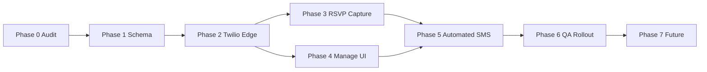

# Event SMS Support — Roadmap

Date: 2026-06-02

**Status:** Planning only. No migrations, runtime code, Edge Functions, Twilio wiring, or `portal/events.html` changes until approved phases.

## Related docs

| Doc | Purpose |
| --- | --- |
| `001_event_sms_support_audit_and_plan.md` | Current-state audit, data model, Twilio/RLS/UI plans, risks |
| `docs/improvements/pages/events/list.md` | Events improvement backlog (add **003** when ready) |
| `docs/improvements/pages/events/moderation/000_event_coordinator_role_audit.md` | Event Coordinator RBAC |
| `docs/todo.md` | Product notes on SMS vs push (lines 14–15) |

---

## Goal

Add **optional guest phone + SMS consent** at RSVP, **member event SMS opt-in** using profile phone when available, **automated** RSVP confirmation and 24-hour reminders, and **manual** coordinator/admin SMS from a new **Notifications** tab in Manage Event — on a **shared SMS backend** with **Events-specific** recipient/UI logic.

## Non-goals (this track until later phases)

- Database migrations (until Phase 1 approved)
- Twilio production send (until Phase 2+)
- Email or push inside the Notifications tab (Phase 7)
- Moving or merging the existing PWA push stack
- Per-event coordinator assignment (global `events.manage_all` remains today)
- Member profile phone editing in portal (can follow RSVP SMS work)

---

## Phase 0 — Discovery / audit

**Deliverable:** `001_event_sms_support_audit_and_plan.md` (this repo).

| Area | What to verify | Status |
| --- | --- | --- |
| Guest RSVP | `js/events/rsvp.js`, `js/events/body.js` (CTA), `rsvp-guest-free`, `create-event-checkout`, `stripe-webhook` | Audited in 001 |
| Member RSVP | `js/portal/events/engagement/rsvp.js` → `event_rsvps` direct / Stripe checkout | Audited in 001 |
| Member phone | `profiles.phone` (migration `083`); admin members UI only today | Audited in 001 |
| Permissions | `events.create`, `events.manage_all`, `events.banners`; no SMS key yet | Audited in 001 |
| Push / PWA | `js/push.js`, `sw.js`, `push_subscriptions`, `send-push-notification`, `notification_preferences` | Audited in 001 |
| Manage Event UI | `js/portal/events/manage/shell.js` — 8 tabs, no Notifications yet | Audited in 001 |
| Edge patterns | Service-role Supabase client, CORS, `user_has_permission` RPC | Audited in 001 |
| Twilio | No runtime integration; `docs/todo.md` + `docs/ROADMAP.md` references only | Audited in 001 |

**Exit criteria:** Stakeholder sign-off on architecture recommendation (shared SMS layer + Events UI), permission name, and first implementation slice.

---

## Phase 1 — Schema / RLS plan

**Deliverable:** Migration spec (e.g. `094_event_sms_notifications.sql`) — **plan only** until explicitly approved to apply.

Planned tables (names may adjust in 001):

| Table | Role |
| --- | --- |
| `sms_phone_contacts` | Normalized E.164 phone, optional `user_id`, audit fields |
| `sms_global_suppressions` | Twilio STOP / admin global block per phone (+ sender scope) |
| `event_sms_recipients` | Per-event opt-in, source, link to RSVP/profile |
| `sms_messages` | Outbound batch (manual/automated), body, sender, event_id |
| `sms_message_deliveries` | Per-recipient Twilio SID + status lifecycle |
| `sms_inbound_messages` | STOP/START/HELP and audit |

**RLS themes:**

- Members: read/update own event recipient row where `user_id = auth.uid()`
- Hosts / `events.manage_all` / **`events.manage_notifications`**: read recipients + message history for managed events
- Inserts/updates to recipients from RSVP: **service role** via Edge Functions (not anon client writes)
- Global suppressions: service role + admin read; inbound webhook service role only

**Exit criteria:** Reviewed ERD + RLS matrix; no conflict with `event_guest_rsvps` uniqueness (`event_id`, `guest_email`).

---

## Phase 2 — Twilio Edge Function plan

**Deliverable:** Function contracts + env checklist (no deploy until secrets confirmed).

| Function | Purpose |
| --- | --- |
| `send-sms` (shared) | Core send: validate phone, check suppression, Twilio API, write deliveries |
| `send-event-sms` | Event wrapper: resolve recipients, permission check, call `send-sms` |
| `twilio-sms-status-callback` | Delivery status updates (`queued` → `delivered` / `failed` / `undelivered`) |
| `twilio-sms-inbound-webhook` | STOP/START/HELP; update global suppression + optional event opt-out |
| `schedule-event-sms-reminders` | Cron: 24h-before reminder to opted-in event recipients only |

**Env vars (planned):**

- `TWILIO_ACCOUNT_SID`
- `TWILIO_AUTH_TOKEN`
- `TWILIO_FROM_PHONE` and/or `TWILIO_MESSAGING_SERVICE_SID`

**Exit criteria:** Staging webhook URLs documented; signature validation design agreed.

---

## Phase 3 — RSVP capture

**Guest (public `js/events/*`):**

- Optional `tel` input + SMS consent checkbox (suggested copy in 001)
- Auto-check consent when phone non-empty; require consent if phone present
- Persist via `rsvp-guest-free` / `create-event-checkout` metadata → Edge Function upsert `event_sms_recipients`
- Paid guest path: same fields in CTA + main form; webhook/edge completes recipient row

**Member (portal `engagement/rsvp.js` + detail UI):**

- On RSVP `going`: if `profiles.phone` present, show event SMS opt-in (default off or respect prior event preference — product choice in 001)
- No block if phone missing
- Optional: settings toggle later (`notification_preferences` extension or separate member SMS prefs)

**Exit criteria:** Staging RSVP creates recipient rows; no SMS sent until Phase 5.

---

## Phase 4 — Manage Event Notifications UI

**Deliverable:** New tab in `EventsManage` shell — label **Notifications** (SMS v1 inside).

| Capability | Notes |
| --- | --- |
| Recipients table | Opt-in/out, source, phone (masked), delivery summary |
| Filters | Opted-in only, source, status |
| Selection | Individual + “all opted-in” |
| Send modal | Compose + headcount + confirm |
| Message history | Batch list + drill-down failures |

**Files (planned):** `manage/notifications.js`, `shell.js` tab entry, `sheet.js` router — follow `manage/rsvps.js` patterns.

**Permission gate:** `events.manage_notifications` OR host/creator OR `events.manage_all` (see 001).

**Exit criteria:** Manual send works in staging with Twilio test credentials; RLS prevents non-host members from reading other guests’ phones.

---

## Phase 5 — Automated messages

| Message | Trigger | Audience |
| --- | --- | --- |
| RSVP confirmation | After successful guest/member RSVP (async, non-blocking) | Opted-in + valid phone + not globally suppressed |
| 24h reminder | Cron `schedule-event-sms-reminders` | Same; **not** the existing 7d/3d/day-of **push** windows |
| Cancellation / major update | **Manual** prompt when event cancelled/deleted — no blind auto-send | Coordinator confirms in modal |

**Exit criteria:** Message bodies include title, date/time, location when not gated; raffle/docs mentioned only when relevant flags set.

---

## Phase 6 — QA / rollout

| Area | Checks |
| --- | --- |
| Staging | Guest + member RSVP, paid guest, manage tab send, history |
| Twilio | Sandbox/live number, status callback, inbound STOP |
| Compliance | Consent only when phone provided; STOP suppresses global send |
| Permissions | Host without `events.manage_notifications` denied; coordinator allowed |
| RLS | Cross-event phone leakage tests |
| Production | Checklist: secrets, webhook URLs, cron job, rollback (disable cron + feature flag) |

**Exit criteria:** Production rollout sign-off; monitor failed deliveries first 48h.

---

## Phase 7 — Future

- Email channel in Notifications tab (shared `notification_*` tables evolution)
- Bridge to PWA push preferences (separate channels, unified prefs UI — **do not merge stacks prematurely**)
- Dedicated JMLLC Twilio number/account
- Message templates, scheduled manual sends
- Website-wide SMS (billing, subscription) reusing shared `send-sms`
- Member portal phone edit + global SMS category prefs

---

## Recommended first implementation slice

After Phase 0 approval:

1. **Phase 1** — migration `094_*` (schema + RLS only)
2. **Phase 2** — `send-sms` + `twilio-sms-inbound-webhook` + `twilio-sms-status-callback` (staging)
3. **Phase 3** — guest RSVP fields + edge upsert (no automated send yet)
4. **Phase 4** — Notifications tab + manual send
5. **Phase 5** — RSVP confirmation + 24h cron + cancel prompt

This order establishes **compliance and observability** before automations.

---

## Dependency order (diagram)

