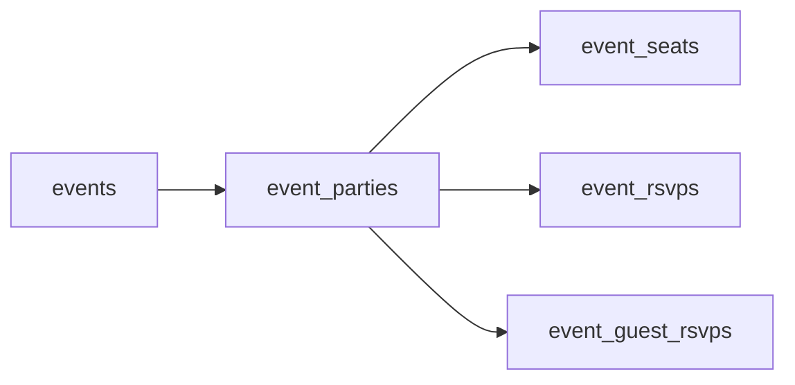

# Event seat / party model — migration draft

**Status:** Applied to remote `justicemcnealllc_db2` on 2026-08-30 via `20260830215901_096_event_parties_and_seats.sql`  
**Date:** 2026-08-30  
**Parent:** [000_events_system_overhaul_brainstorm.md](./000_events_system_overhaul_brainstorm.md) (§13.1)  
**Related:** [001_event_pricing_fields_migration_draft.md](./001_event_pricing_fields_migration_draft.md)  
**Builds on:** `event_rsvps` / `event_guest_rsvps` (`063`, `065`)

---

## 1. Goals

Introduce a **party** (payer / legal / payment unit) and **seats** (each person on the trip) so Colorado-style multi-person RSVPs work without inventing a lightweight membership tier.

- Adult | kid seats with included-option answers (JSON)
- Disclaimer acknowledgments **once per party**
- Amenity vote **once per party** (provisional → counted / removed)
- Clear payer link (`paid_by` = party payer via `party_id`, not a per-seat money column)
- Keep member/guest RSVP tables for identity + QR/tickets; link them with `party_id`

## 2. Non-goals (this draft)

- Applying migration live
- Payment schedule / Stripe tables (next §13.1 item; will FK `event_parties.id`)
- Included-options **catalog** or amenity **options catalog** tables (create-flow later; seats/parties store answers/vote ids)
- Replacing or dropping `event_rsvps` / `event_guest_rsvps`
- Flow **D** (verify-code bank share)

---

## 3. Conceptual model

| Concept | Table | Role |
| --- | --- | --- |
| Event | `events` | Pricing, capacity, deadlines (001) |
| Party | `event_parties` | Who pays; disclaimer ack; amenity vote; future payment schedule |
| Seat | `event_seats` | Each adult/kid; options; info-invite for flow B |
| Payer identity | `event_rsvps` or `event_guest_rsvps` | One primary row per party for ticket/check-in compat |

**`paid_by`:** Seats inherit the payer through `party_id`. Do not store a separate `paid_by` money FK on each seat for MVP.

---

## 4. `event_parties`

| Column | Type | Default | Meaning |
| --- | --- | --- | --- |
| `id` | `UUID PK` | `gen_random_uuid()` | |
| `event_id` | `UUID NOT NULL` → `events` | | |
| `payer_kind` | `TEXT NOT NULL` | | `'member'` \| `'guest'` |
| `payer_user_id` | `UUID NULL` → `profiles` | | Required when `payer_kind = 'member'` |
| `payer_guest_rsvp_id` | `UUID NULL` → `event_guest_rsvps` | | Required when `payer_kind = 'guest'` |
| `status` | `TEXT NOT NULL` | `'draft'` | `'draft'` \| `'pending_payment'` \| `'active'` \| `'cancelled'` |
| `disclaimer_acks` | `JSONB NOT NULL` | `'[]'` | Array of `{ "id": "<clause_id>", "acked_at": "<iso>" }` — **once per party** |
| `amenity_vote_option_id` | `TEXT NULL` | | Chosen amenity option id (catalog later); null if no vote |
| `amenity_vote_status` | `TEXT NOT NULL` | `'none'` | `'none'` \| `'provisional'` \| `'counted'` \| `'removed'` |
| `invite_token` | `TEXT UNIQUE` | generated | Party-scoped magic link (payment progress page); distinct from seat info-invite |
| `created_at` | `TIMESTAMPTZ` | `now()` | |
| `updated_at` | `TIMESTAMPTZ` | `now()` | |

### Payer constraints

- `payer_kind = 'member'` → `payer_user_id IS NOT NULL` AND `payer_guest_rsvp_id IS NULL`
- `payer_kind = 'guest'` → `payer_guest_rsvp_id IS NOT NULL` AND `payer_user_id IS NULL`
- Unique optional later: one active party per `(event_id, payer_user_id)` / `(event_id, payer_guest_rsvp_id)` — enforce in app for MVP; DB unique partial indexes recommended at apply time

### Vote lifecycle (party-level)

| Status | When |
| --- | --- |
| `none` | No amenities voting, or skipped |
| `provisional` | Voted during RSVP before payment commit |
| `counted` | Payment plan committed (or free-event RSVP complete) |
| `removed` | Cancelled / never paid / host removed |

---

## 5. `event_seats`

| Column | Type | Default | Meaning |
| --- | --- | --- | --- |
| `id` | `UUID PK` | | |
| `event_id` | `UUID NOT NULL` → `events` | | Denormalized for easy roster queries |
| `party_id` | `UUID NOT NULL` → `event_parties` | | |
| `role` | `TEXT NOT NULL` | | `'adult'` \| `'kid'` |
| `display_name` | `TEXT NOT NULL` | | Roster name |
| `email` | `TEXT NULL` | | Flow B contact |
| `phone` | `TEXT NULL` | | Flow B / SMS info invite |
| `options` | `JSONB NOT NULL` | `'{}'` | Map of included-option answers, e.g. `{ "shirt_size": "M" }` |
| `options_complete` | `BOOLEAN NOT NULL` | `FALSE` | True when all required options filled |
| `info_invite_token` | `TEXT UNIQUE NULL` | | Flow **B** “fill sizes only” link |
| `linked_user_id` | `UUID NULL` → `profiles` | | Optional: seat is this member |
| `linked_guest_rsvp_id` | `UUID NULL` → `event_guest_rsvps` | | Optional: seat is this guest row |
| `sort_order` | `INT NOT NULL` | `0` | Display order (payer usually `0`) |
| `created_at` | `TIMESTAMPTZ` | `now()` | |

### Seat rules

- Payer is always represented as a seat (typically first adult, `sort_order = 0`)
- Billable amount for a party (app): sum seat prices using event `adult_price_cents` / `kids_free` / `kid_price_cents` from 001
- Capacity counting (app): use `role` + event `capacity_counts` (`adults` vs `all`)

---

## 6. Legacy RSVP link

Add nullable `party_id UUID REFERENCES event_parties(id)` to:

- `event_rsvps`
- `event_guest_rsvps`

**MVP rule:** one **primary** RSVP row per party for the **payer** (member or guest) for existing ticket/QR/check-in paths. Covered spouse/kids are **seats only** until flow C/E gives them their own RSVP.

Chicken-and-egg for guest payers: create `event_guest_rsvps` first (or in same transaction), then party with `payer_guest_rsvp_id`, then set `event_guest_rsvps.party_id`, then seats. Document for edge-function implementers.

---

## 7. Guest payment flows vs schema

| Flow | How this model supports it |
| --- | --- |
| **A** Payer-owned | One party; many seats; options filled by payer; ack + vote on party |
| **B** Info invite | Seats with `info_invite_token`; guest updates `options` / `options_complete`; party still pays |
| **C** Self-pay | Separate party (+ primary RSVP) per payer |
| **E** Attach later | Create seat (or pending party); reassign `party_id` / merge — FINAL |
| **D** | Out of product — deferred; not on roadmap for Colorado (no verify-code bank share) |

---

## 8. RLS notes (draft intent)

| Role | Access |
| --- | --- |
| `service_role` | Full CRUD (edge functions, webhooks) |
| Host / admin / creator | SELECT (and manage mutate via existing host patterns) parties + seats for their events |
| Authenticated member payer | SELECT/UPDATE own party where `payer_user_id = auth.uid()`; SELECT seats for that party |
| Anon | SELECT/UPDATE seat by `info_invite_token` only (options fields); SELECT party payment page by `invite_token` via edge function preferred over wide anon SELECT |

Prefer **edge-function-mediated** token access over broad anon policies (same spirit as guest checkout today). Exact policies finalized at apply / RLS FINAL checklist item.

---

## 9. Pricing / capacity interaction

- Party base total = Σ seat prices from event pricing columns (001)
- Card fee applied at party/payment layer (not per seat)
- Capacity: count seats by `capacity_counts` before accepting new seats/parties

---

## 10. Applied SQL

Migration file: [`supabase/migrations/20260830215901_096_event_parties_and_seats.sql`](../../../../supabase/migrations/20260830215901_096_event_parties_and_seats.sql)

Note: `invite_token` default uses `extensions.gen_random_bytes(16)` (required on remote).

---

## 11. Done criteria for this checklist item

- [x] Parties + seats documented
- [x] Once-per-party disclaimer + vote locked
- [x] Legacy `party_id` link documented
- [x] Flows A/B/C/E mapped
- [x] Live migration applied — `20260830215901_096_…` on remote 2026-08-30
