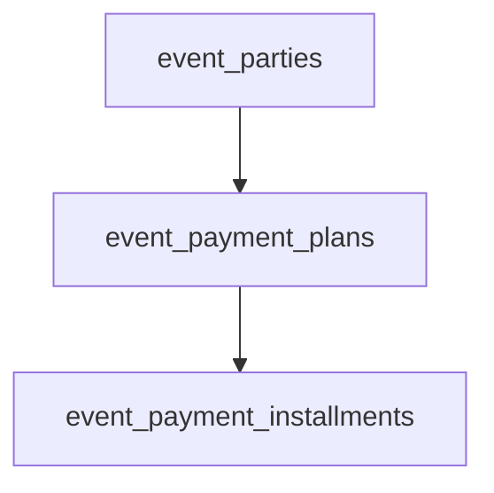

# Event payment schedule — migration draft

**Status:** Applied to remote `justicemcnealllc_db2` on 2026-08-30 via `20260830220000_097_event_payment_schedules.sql`  
**Date:** 2026-08-30  
**Parent:** [000_events_system_overhaul_brainstorm.md](./000_events_system_overhaul_brainstorm.md) (§13.1)  
**Depends on:** [002_event_seat_party_model_migration_draft.md](./002_event_seat_party_model_migration_draft.md) (`event_parties`)  
**Related:** [001_event_pricing_fields_migration_draft.md](./001_event_pricing_fields_migration_draft.md)

---

## 1. Goals

App-owned payment plans for event **parties**:

- Pay **in full** or **monthly** until a snapshotted `fund_deadline`
- Monthly amount ≈ `remaining ÷ months_remaining` (recalculate when early payments change remaining)
- **Anniversary** debit day from plan `anchor_at` (not a fixed calendar day, not Stripe Subscription)
- Method **`ach` | `card`**; card charges are fee-inclusive
- Track remaining, next debit, installment history, Stripe customer / PM / PaymentIntent ids
- On plan **commit**: party amenity vote → `counted` (app rule)

## 2. Non-goals

- Live migration apply / webhooks / cron (later)
- Stripe **Subscription** objects
- In-app refunds (product: no refunds)
- Changing contribution `subscriptions` / LLC billing tables

---

## 3. Locked decisions

| Topic | Decision |
| --- | --- |
| Schedule owner | **App tables**, not Stripe Subscription |
| Debit day | **Anniversary** of `anchor_at` (clamp short months: Jan 31 → Feb 28/29) |
| Unit | **One plan per party** (`party_id` UNIQUE) |
| Monthly math | `ceil` or banker’s split documented at implement; draft uses integer cents with last installment absorbing remainder |
| Fund deadline | **Snapshot** onto plan at commit so host edits to event deadline do not silently rewrite active plans |
| Card fees | Included in installment `amount_cents` / plan `total_due_cents`; `fee_cents` stored for reporting |

---

## 4. Model

---

## 5. `event_payment_plans` (1:1 with party)

| Column | Type | Default | Meaning |
| --- | --- | --- | --- |
| `id` | `UUID PK` | | |
| `party_id` | `UUID NOT NULL UNIQUE` → `event_parties` | | One plan per party |
| `event_id` | `UUID NOT NULL` → `events` | | Denormalized |
| `plan_kind` | `TEXT NOT NULL` | | `'full'` \| `'monthly'` |
| `method` | `TEXT NOT NULL` | | `'ach'` \| `'card'` |
| `currency` | `TEXT NOT NULL` | `'usd'` | |
| `base_total_cents` | `INT NOT NULL` | | Seat-sum before card fee |
| `fee_cents` | `INT NOT NULL` | `0` | Card fee portion (0 for ACH) |
| `total_due_cents` | `INT NOT NULL` | | What payer owes (`base + fee` for card) |
| `amount_paid_cents` | `INT NOT NULL` | `0` | Sum of succeeded installments |
| `remaining_cents` | `INT NOT NULL` | | Maintain on write: `total_due - amount_paid` |
| `fund_deadline` | `TIMESTAMPTZ NOT NULL` | | Snapshot at commit |
| `anchor_at` | `TIMESTAMPTZ NOT NULL` | | Plan start; anniversary basis |
| `next_debit_at` | `TIMESTAMPTZ NULL` | | Next pending due; null if complete/cancelled |
| `status` | `TEXT NOT NULL` | `'setup'` | `'setup'` \| `'active'` \| `'past_due'` \| `'completed'` \| `'cancelled'` |
| `stripe_customer_id` | `TEXT NULL` | | Guests + members |
| `stripe_payment_method_id` | `TEXT NULL` | | |
| `amenity_vote_committed_at` | `TIMESTAMPTZ NULL` | | Set when plan becomes `active` (vote counted) |
| `created_at` / `updated_at` | | | |

### Status meanings

| Status | Meaning |
| --- | --- |
| `setup` | PM not yet attached / first charge not committed |
| `active` | On track; has future or in-flight installments |
| `past_due` | Latest attempt failed; retry needed |
| `completed` | `remaining_cents = 0` |
| `cancelled` | Party cancelled; pending installments cancelled (no refunds of succeeded) |

### Checks

- `base_total_cents >= 0`, `fee_cents >= 0`, `total_due_cents >= 0`
- `amount_paid_cents >= 0`, `remaining_cents >= 0`
- `plan_kind IN ('full','monthly')`, `method IN ('ach','card')`
- Prefer `total_due_cents = base_total_cents + fee_cents` (enforce in app; optional CHECK)

---

## 6. `event_payment_installments`

| Column | Type | Default | Meaning |
| --- | --- | --- | --- |
| `id` | `UUID PK` | | |
| `plan_id` | `UUID NOT NULL` → `event_payment_plans` | | |
| `event_id` | `UUID NOT NULL` | | |
| `party_id` | `UUID NOT NULL` | | |
| `sequence` | `INT NOT NULL` | | 1..n within plan |
| `kind` | `TEXT NOT NULL` | | `'scheduled'` \| `'payoff'` \| `'full'` |
| `due_at` | `TIMESTAMPTZ NOT NULL` | | |
| `amount_cents` | `INT NOT NULL` | | To charge / charged (fee-inclusive if card) |
| `status` | `TEXT NOT NULL` | `'pending'` | `'pending'` \| `'processing'` \| `'succeeded'` \| `'failed'` \| `'cancelled'` |
| `stripe_payment_intent_id` | `TEXT NULL` | | |
| `stripe_charge_id` | `TEXT NULL` | | |
| `attempted_at` | `TIMESTAMPTZ NULL` | | |
| `succeeded_at` | `TIMESTAMPTZ NULL` | | |
| `failure_code` | `TEXT NULL` | | |
| `failure_message` | `TEXT NULL` | | |
| `created_at` / `updated_at` | | | |

Unique `(plan_id, sequence)`.

### Generation rules

**Full (`plan_kind = full`):**

- One installment: `kind = 'full'`, `due_at = anchor_at`, `amount_cents = total_due_cents`
- On success → plan `completed`, `next_debit_at = null`, `remaining_cents = 0`

**Monthly (`plan_kind = monthly`):**

- At commit, **pre-generate** `pending` `scheduled` rows from `anchor_at` through `fund_deadline` (inclusive of final month)
- Each open installment amount ≈ `remaining_at_generation ÷ open_count` (integer cents; last row gets remainder)
- `due_at` = anniversary series: `anchor_at`, then +1 month, +2 months… clamped to month-end; do not schedule past `fund_deadline` (last due ≤ deadline)
- `next_debit_at` = earliest `pending`/`failed` due

**Early payoff:**

- Insert `kind = 'payoff'` for current `remaining_cents`
- Set all future `pending` `scheduled` rows to `cancelled`
- On payoff success → plan `completed`

**Recalculate:** If a scheduled payment succeeds early or amount changes, rebuild amounts on remaining `pending` scheduled rows (keep `due_at`s unless product says otherwise).

---

## 7. Stripe approach (document only)

1. SetupIntent / Checkout collects ACH or card PM → store `stripe_customer_id` + `stripe_payment_method_id` on plan; status → `active` when first charge succeeds or when PM attached and schedule armed (define at edge-contract pass: prefer **active when PM saved and first installment processing or full pending**).
2. Members: may reuse `stripe_customers` table; still **copy** ids onto plan for guests and audit.
3. Guests: create Stripe Customer at plan setup; ids live on plan only.
4. Worker/cron: select installments where `status IN ('pending','failed')` and `due_at <= now()` → PaymentIntent off-session → `processing`.
5. Webhook: succeed/fail → update installment; roll up plan `amount_paid_cents`, `remaining_cents`, `next_debit_at`, `status`; on first successful commit set `amenity_vote_committed_at` and party `amenity_vote_status = 'counted'`.
6. No refund PaymentIntents from this product path.

---

## 8. Party / vote coupling

When plan leaves `setup` into `active` (or on first `succeeded` installment — pick one in edge contract; **draft default: first succeeded charge or full/payoff success**):

- Set `amenity_vote_committed_at`
- If party vote was `provisional` → `counted`
- If party cancelled / plan `cancelled` with never-succeeded → vote `removed`

---

## 9. RLS notes (draft)

| Role | Access |
| --- | --- |
| `service_role` | Full CRUD |
| Host/admin | SELECT plans/installments for their events |
| Member payer | SELECT own plan via party `payer_user_id` |
| Anon | No direct table access; magic-link page via edge + `party.invite_token` |

---

## 10. Applied SQL

Migration file: [`supabase/migrations/20260830220000_097_event_payment_schedules.sql`](../../../../supabase/migrations/20260830220000_097_event_payment_schedules.sql)

---

## 11. Example (Colorado-shaped)

- Party: 2 adults × $1000 = `$200000` base; ACH → `fee_cents = 0`, `total_due = 200000`
- Monthly, `anchor_at = 2026-11-15`, `fund_deadline = 2027-11-01` → ~12 anniversary dues; each ≈ remaining/open count
- After 3 successes, remaining `$150000`; payoff installment `$150000`; cancel later scheduled rows

Card path: same base; `fee_cents` from `card_fee_bps` / platform default; installments use fee-inclusive amounts so net ≈ base.

---

## 12. Done criteria for this checklist item

- [x] Plans + installments documented
- [x] Anniversary + app-owned schedule locked
- [x] Full / monthly / payoff rules documented
- [x] Stripe ids + webhook/cron intent documented
- [x] Live migration applied — `20260830220000_097_…` on remote 2026-08-30
