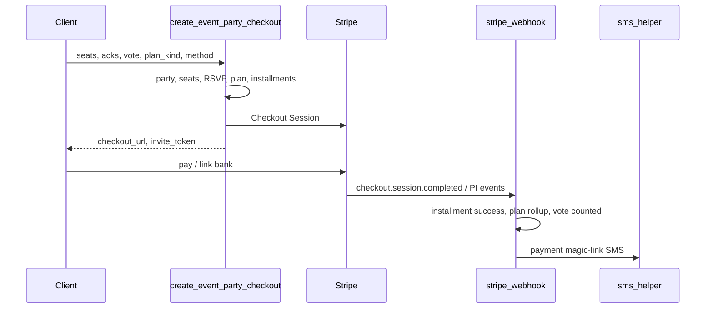

# Event edge function contracts (sketch)

**Status:** Partial — ACH + card fee-inclusive collect ships via existing [`create-event-checkout`](../../../../supabase/functions/create-event-checkout/index.ts) (§13.10); dedicated `create-event-party-checkout` rename/split still future.  
**Date:** 2026-08-30 (ACH/card notes 2026-09-02)  
**Parent:** [000_events_system_overhaul_brainstorm.md](./000_events_system_overhaul_brainstorm.md) (§13.1)  
**Depends on:** [001](./001_event_pricing_fields_migration_draft.md) · [002](./002_event_seat_party_model_migration_draft.md) · [003](./003_event_payment_schedule_migration_draft.md)

---

## 1. Goals

Define request/response/auth contracts for:

1. Creating a party RSVP + payment plan and starting **Stripe Checkout**
2. Extending **stripe-webhook** for installment lifecycle
3. **Magic-link** party payment reads / payoff
4. **Host SMS invites** (event URL) vs **payment magic-link SMS**
5. Cron name for due installments (pointer only)

**Locked UX:** Stripe **Checkout redirect** for attaching ACH/card and first/full charge (same family as [`create-event-checkout`](../../../../supabase/functions/create-event-checkout/index.ts)). Legacy one-shot checkout remains until FINAL compat.

**Implementation note (2026-09-02):** Until a rename/split, **ACH collect** (Stripe Customer always, `payment_method_types: ['us_bank_account']`, `setup_future_usage: 'off_session'`, persist `stripe_customer_id` + `stripe_payment_method_id` on `event_payment_plans`) is implemented in **`create-event-checkout`** + **`stripe-webhook`** / `completePaidRsvpAfterCheckout` — not a separate `create-event-party-checkout` yet.

**Card fee path (2026-09-02):** Same function charges the **fee-inclusive** card total (`resolveCheckoutTotals` / `card_fee_bps`), creates a Customer for guests, sets `setup_future_usage: 'off_session'` for card, and RSVP CTAs show ACH vs fee-inclusive card amounts.

**Full pay completion (2026-09-02):** `plan_kind=full` Checkout charges plan `total_due_cents`; `completePaidRsvpAfterCheckout` / `enforceFullPlanCompleted` force `status=completed`, `remaining_cents=0`, `next_debit_at=null`, and cancel leftover pending installments.

**Monthly schedule (2026-09-02):** Prep pre-generates `scheduled` installments via `payment-schedule.ts` (amounts = remaining ÷ months left); Checkout charges **first installment only**; webhook leaves plan `active` with `remaining_cents` and `next_debit_at` = next pending due. Debit cron still future.

**Schedule status webhooks (2026-09-02):** `payment_intent.succeeded` / `payment_failed` / `processing` and `checkout.session.expired` update installment + plan via `payment-schedule-webhook.ts` (`applyInstallmentSucceeded` / `Failed` / `Processing`). SMS notify on fail still later (FINAL).

**Early payoff (2026-09-02):** [`request-event-party-payoff`](../../../../supabase/functions/request-event-party-payoff/index.ts) cancels future `scheduled` rows, creates `kind=payoff`, charges remaining via off-session PM or Checkout; webhook completes plan. Magic-link CTA still §13.11.

**Failed payment UX (2026-09-02, §13.10 line 440):** On `payment_intent.payment_failed` → installment `failed` + plan `past_due` + SMS (`message_type=event_payment_failed`, gated by `SMS_PAYMENT_FAILURES_ENABLED` / `SMS_SEND_ENABLED`) with link `/events/payments/?t={invite_token}`. Idempotent via `failure_notified_at`. Edges: [`get-event-party-payments`](../../../../supabase/functions/get-event-party-payments/index.ts), [`retry-event-party-payment`](../../../../supabase/functions/retry-event-party-payment/index.ts) (`kind=retry`), [`update-event-party-payment-method`](../../../../supabase/functions/update-event-party-payment-method/index.ts) (Checkout `mode=setup`, `kind=pm_update`). Minimal public page: [`events/payments/`](../../../../events/payments/index.html). Full schedule UI / early-payoff polish remains §13.11.

**Magic-link payments auth (2026-09-03, §13.11 line 445):** Public route [`/events/payments/`](../../../../events/payments/index.html). Auth via `invite_token` (`?t=` — canonical), `guest_token` (`?g=` → resolve payer party, client rewrites to `?t=`), or JWT member payer (omit token when exactly one party+plan; else `party_id` / `event_id` / `event_slug`). Shared: [`event-party-token.ts`](../../../../supabase/functions/_shared/event-party-token.ts).

**Webhook idempotency + reconcile (2026-09-03, §13.10 line 441):** `stripe_webhook_events` stores Stripe `event.id` (dedupe) + outcome (`processed`/`error`). [`stripe-webhook`](../../../../supabase/functions/stripe-webhook/index.ts) claims before handlers; duplicates return 200 without re-running. Mid-flight errors after claim are recovered by [`reconcile-event-party-payments`](../../../../supabase/functions/reconcile-event-party-payments/index.ts) (hourly cron): stuck `processing` installments &gt;15m with a PI id → retrieve Stripe → `applyInstallmentSucceeded` / `Failed` (no failure SMS from reconcile).

---

## 2. Non-goals

- Implementing Deno functions
- Applying SQL
- Stripe Elements / on-page Payment Element
- In-app refunds

**No in-app refunds (2026-09-03, §13.10 line 442):** [`process-event-cancellation`](../../../../supabase/functions/process-event-cancellation/index.ts) is **status-only** (no `stripe.refunds.create`). Grace / `single_user_refund` returns 400. Host runbook: [007_host_out_of_band_refunds.md](./007_host_out_of_band_refunds.md).

---

## 3. Sequence — RSVP → Checkout → webhook → SMS



---

## 4. `create-event-party-checkout` (new)

| | |
| --- | --- |
| **Auth** | Optional JWT (member). Guests: no JWT; require name/email/phone. |
| **Public** | Yes (CORS like `create-event-checkout`) |
| **Idempotency** | Optional header `Idempotency-Key`; also reject duplicate open party for same guest email / member on event |

### Request body

| Field | Type | Notes |
| --- | --- | --- |
| `event_id` | uuid | Required (or `slug` resolved server-side) |
| `guest_name` / `guest_email` / `guest_phone` | string | Required if no JWT |
| `sms_opt_in` / consent fields | | Align with existing guest SMS consent |
| `seats` | array | `{ role: 'adult'\|'kid', display_name, email?, phone?, options? }[]` — include payer as first adult |
| `disclaimer_acks` | array | `{ id, acked_at }[]` — required clauses |
| `amenity_vote_option_id` | string\|null | Optional; stored provisional on party |
| `plan_kind` | `'full'`\|`'monthly'` | |
| `method` | `'ach'`\|`'card'` | Must be enabled on event |
| `success_url` / `cancel_url` | string | Checkout return URLs; may include `{CHECKOUT_SESSION_ID}` |

### Server steps

1. Load event; reject if not open / RSVP disabled / member_only without JWT
2. Capacity check using seats + `capacity_mode` / `capacity_counts`
3. Compute `base_total_cents` from seats + pricing columns; apply card fee → `fee_cents` / `total_due_cents`
4. Create guest or use member; create `event_parties` + seats + primary `event_rsvps` / `event_guest_rsvps` with `party_id`
5. Create `event_payment_plans` (`status=setup`) + installments (`pending`); snapshot `fund_deadline`; set `anchor_at=now`
6. Create Stripe Checkout Session:
   - Line item amount = first installment (`full` or first `scheduled`) fee-inclusive
   - `payment_method_types` include `us_bank_account` and/or `card` per `method` (prefer single method per session)
   - `customer_creation` / existing customer for members via `stripe_customers` when present
   - `metadata`: `party_id`, `plan_id`, `installment_id`, `event_id`, `jm_type=event_party_plan`
   - Save PM for future off-session (`setup_future_usage` / customer attachment as Stripe allows for ACH)
7. Return checkout URL

### Response `200`

```json
{
  "party_id": "...",
  "plan_id": "...",
  "invite_token": "...",
  "checkout_url": "https://checkout.stripe.com/...",
  "seat_info_tokens": [{ "seat_id": "...", "info_invite_token": "..." }]
}
```

### Errors

| Code / message | When |
| --- | --- |
| `event_not_found` | Bad id |
| `rsvp_closed` | Status / deadline |
| `capacity_full` | Hard capacity |
| `invalid_seats` | Empty / bad roles |
| `disclaimers_required` | Missing acks |
| `method_disabled` | ACH/card off on event |
| `pricing_invalid` | Kids paid without kid price, etc. |

---

## 5. Extend `stripe-webhook`

Existing: [`supabase/functions/stripe-webhook/index.ts`](../../../../supabase/functions/stripe-webhook/index.ts)

### New / extended handlers (when `metadata.jm_type === 'event_party_plan'`)

| Stripe event | Action |
| --- | --- |
| `checkout.session.completed` | Attach `stripe_customer_id` + PM to plan; link PI to first installment; mark processing/succeeded as appropriate |
| `payment_intent.succeeded` | Installment `succeeded`; roll up `amount_paid_cents`, `remaining_cents`, `next_debit_at`; plan `active` or `completed`; set `amenity_vote_committed_at`; party vote `provisional`→`counted` |
| `payment_intent.payment_failed` / `checkout.session.expired` | Installment `failed` or plan stays `setup`; plan `past_due` if active schedule |
| ACH async success/fail | Same rollup when PI reaches terminal state |

**Idempotency:** skip if installment already `succeeded` for that `stripe_payment_intent_id`.

**Side effects on first success:** SMS payment magic link (`party.invite_token` → public payments URL). Reuse `_shared/sms.ts` / confirmation patterns; respect `SMS_SEND_ENABLED`.

**Explicitly ignore:** Refund success paths for product refunds (none).

Legacy RSVP/raffle checkout metadata paths unchanged.

---

## 6. `get-event-party-payments` (public via token)

| | |
| --- | --- |
| **Auth** | Body `invite_token` **or** `guest_token` **or** JWT member payer. No anon table access. |
| **Method** | POST preferred (token not in referrer logs) |

### Request

`{ "invite_token": "..." }` **or** `{ "guest_token": "..." }` **or** JWT + optional `{ "party_id" | "plan_id" | "event_id" | "event_slug" }`

Canonical public URL after load: `/events/payments/?t={invite_token}`.

### Response

```json
{
  "event": { "id", "title", "slug" },
  "party_id": "...",
  "plan": {
    "plan_kind", "method", "status",
    "base_total_cents", "fee_cents", "total_due_cents",
    "amount_paid_cents", "remaining_cents",
    "next_debit_at", "fund_deadline", "anchor_at"
  },
  "installments": [
    { "sequence", "kind", "due_at", "amount_cents", "status" }
  ],
  "seats_summary": [{ "role", "display_name", "options_complete" }]
}
```

No raw payment method numbers; no Stripe secret fields.

### Errors

`invalid_token`, `party_cancelled`

---

## 7. `request-event-party-payoff`

| | |
| --- | --- |
| **Auth** | `invite_token` **or** JWT member payer for that party |

### Behavior

1. Validate plan `active`/`past_due` and `remaining_cents > 0`
2. Insert installment `kind=payoff`, cancel future `pending` scheduled
3. If `stripe_payment_method_id` present → create off-session PaymentIntent (preferred)
4. Else → Stripe Checkout session for `remaining_cents` (locked method **A** fallback)
5. Return `{ checkout_url? }` or `{ status: 'processing', installment_id }`

Webhook completes rollup → plan `completed`.

---

## 8. Host SMS invites — `send-event-invites` (thin wrapper)

Prefer a dedicated function that wraps shared SMS, or extend [`send-event-sms`](../../../../supabase/functions/send-event-sms/index.ts) with `message_type: 'event_invite'`.

| | |
| --- | --- |
| **Auth** | JWT; `userCanManageEventNotifications` (or host/creator/admin) |
| **Gate** | `SMS_SEND_ENABLED` / dry-run |

### Request

| Field | Notes |
| --- | --- |
| `event_id` | Required |
| `member_ids` | Optional array — resolve phones from profiles |
| `phones` | Optional E.164 extras |
| `dry_run` | Optional |

### Message

Fixed/professional template: event title + public URL (`/events/?e=slug`). **Not** payment magic link.

### Response

`{ sent, dry_run, results: [...] }`

---

## 9. `resend-event-party-payment-link`

| | |
| --- | --- |
| **Auth** | Host JWT **or** `invite_token` (rate-limited) |

SMS body: link to payments page with `invite_token`. Reuse patterns from `send-event-rsvp-confirmation`.

---

## 10. Cron (name only) — `process-event-payment-installments`

- Select installments `status IN ('pending','failed')` and `due_at <= now()`
- Off-session PaymentIntent using plan PM
- Webhook does rollup
- Details: [003](./003_event_payment_schedule_migration_draft.md) §7  
**Not implemented in this sketch.**

---

## 11. Auth matrix

| Function | Anon | Member JWT | Host JWT | Service |
| --- | --- | --- | --- | --- |
| `create-event-party-checkout` | Guest fields | Yes | — | — |
| `get-event-party-payments` | Token | Payer | — | — |
| `retry-event-party-payment` | Token | Payer | — | — |
| `update-event-party-payment-method` | Token | Payer | — | — |
| `request-event-party-payoff` | Token | Payer | — | — |
| `send-event-invites` | No | No | Yes | — |
| `resend-event-party-payment-link` | Token (limited) | — | Yes | — |
| `stripe-webhook` | Stripe sig | — | — | Yes |
| `reconcile-event-party-payments` | No | No | No | Yes |
| Cron installments | — | — | — | Yes |

---

## 12. Client URL conventions (suggested)

| Page | Query |
| --- | --- |
| Checkout success | `/events/payments/?party=…&session_id=…` then resolve via token cookie/SMS |
| Magic link | `/events/payments/?t={invite_token}` |
| Seat info invite (flow B) | `/events/seat-info/?t={info_invite_token}` |
| Host invite target | `/events/?e={slug}` |

Exact routes finalized in magic-link UI checklist item.

---

## 13. Relation to legacy

| Legacy | Role going forward |
| --- | --- |
| `create-event-checkout` | Simple one-shot RSVP/raffle until migrated |
| `rsvp-guest-free` | Free events without payment plan |
| `send-event-sms` | Manual/update SMS; invites may extend or wrap |
| `stripe-webhook` | Add `jm_type=event_party_plan` branch |

---

## 14. Done criteria

- [x] Checkout RSVP+plan contract sketched
- [x] Webhook events listed
- [x] Magic-link get + payoff sketched
- [x] Host invite SMS vs payment SMS distinguished
- [x] Cron named only
- [ ] Implementation — later checklist items
